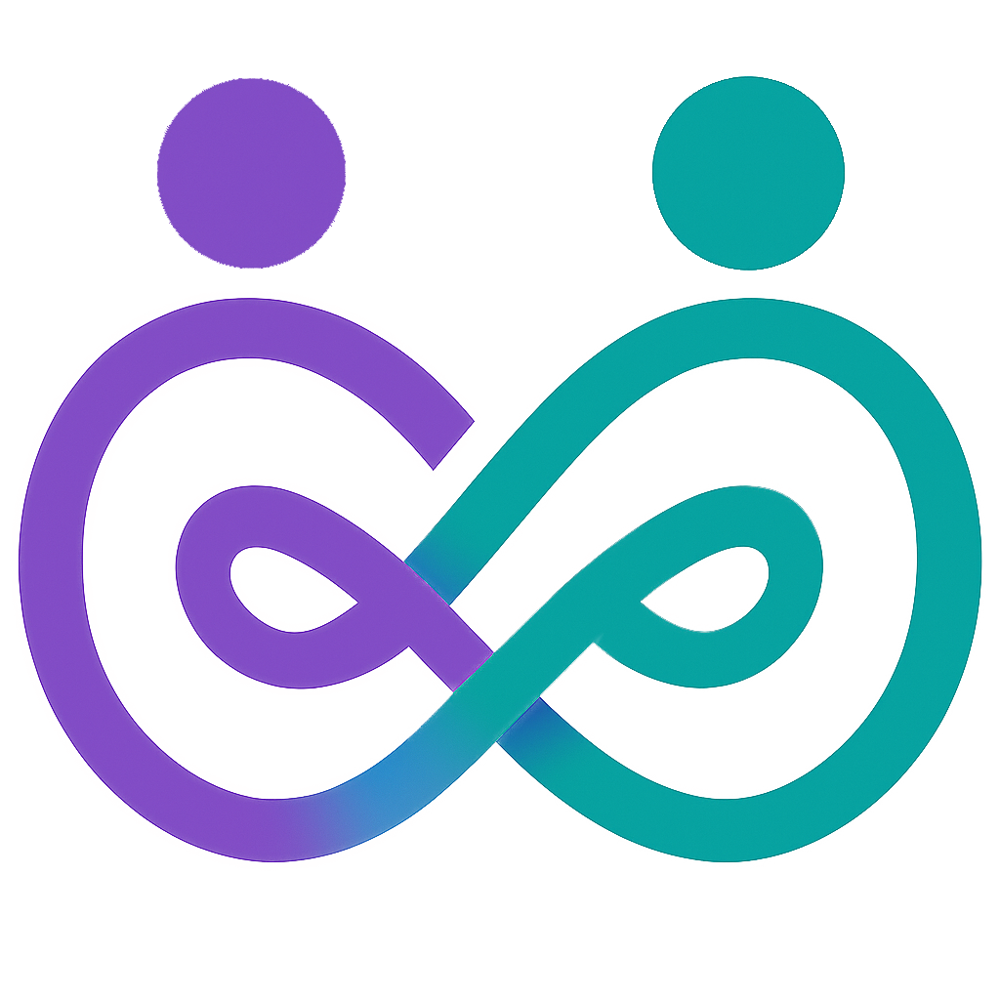
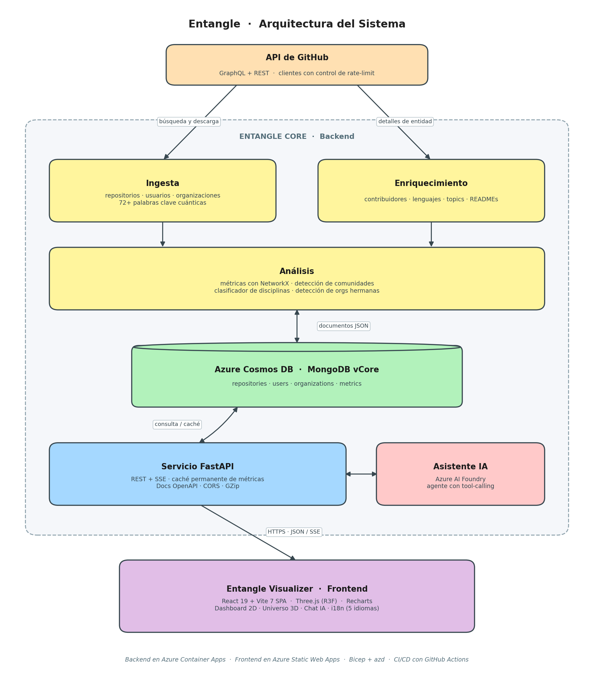

<div align="center">

<sub><a href="./README.md">🇬🇧 English</a>  ·  🇪🇸 <b>Español</b></sub>



# Entangle&nbsp;Core

**Motor de análisis del ecosistema de computación cuántica de código abierto en GitHub.**

Pipeline de ingesta, enriquecimiento, análisis de redes e insights con IA, expuesto a través de un backend FastAPI listo para producción.

[](https://www.python.org/)
[](https://fastapi.tiangolo.com/)
[](https://learn.microsoft.com/azure/cosmos-db/mongodb/vcore/)
[](https://azure.microsoft.com/products/container-apps)
[](./Dockerfile)
[](./tests)
[](#calidad--an%C3%A1lisis-est%C3%A1tico)
[](#calidad--an%C3%A1lisis-est%C3%A1tico)
[](#calidad--an%C3%A1lisis-est%C3%A1tico)
[](./LICENSE)

[**Abrir app**](https://blue-rock-0771cc403.1.azurestaticapps.net) ·
[**Repo del frontend**](https://github.com/Angel-TFG-UCLM/Entangle-Visualizer) ·
[**Reportar un bug**](https://github.com/Angel-TFG-UCLM/Entangle-Core/issues)

</div>

---

## Descripción

**Entangle Core** es la columna vertebral de datos e inteligencia del proyecto [Entangle](https://github.com/Angel-TFG-UCLM/Entangle-Visualizer): una plataforma de calidad investigadora que mapea y analiza el ecosistema global de computación cuántica de código abierto en GitHub.

Rastrea repositorios, organizaciones y desarrolladores públicos que coinciden con una taxonomía curada de más de 70 palabras clave cuánticas (Qiskit, Cirq, PennyLane, Braket, QAOA, VQE, QML, NISQ, etc.), los enriquece con metadatos de colaboración, lenguajes y topics, calcula métricas de red sobre el grafo resultante y lo expone todo a través de una API REST tipada que consume el dashboard [Entangle Visualizer](https://github.com/Angel-TFG-UCLM/Entangle-Visualizer).

> Desarrollado como componente backend de un Trabajo Fin de Grado en la **Universidad de Castilla-La Mancha (UCLM)**.

---

## Tabla de contenidos

- [Características clave](#características-clave)
- [Arquitectura](#arquitectura)
- [Stack tecnológico](#stack-tecnológico)
- [Estructura del proyecto](#estructura-del-proyecto)
- [Primeros pasos](#primeros-pasos)
- [Configuración](#configuración)
- [Ejecución del pipeline](#ejecución-del-pipeline)
- [Referencia de la API](#referencia-de-la-api)
- [Tests](#tests)
- [Calidad & Análisis Estático](#calidad--análisis-estático)
- [Despliegue](#despliegue)
- [Roadmap](#roadmap)
- [Contribuir](#contribuir)
- [Citación](#citación)
- [Licencia](#licencia)
- [Agradecimientos](#agradecimientos)

---

## Características clave

- **Ingesta orientada al dominio.** Búsqueda multi-segmento en GitHub guiada por una taxonomía curada de palabras clave cuánticas, con clientes GraphQL/REST conscientes del rate-limit y modo incremental (solo entidades nuevas o actualizadas).
- **Modelo de tres entidades.** Pipelines independientes de ingesta y enriquecimiento para `repositories`, `users` y `organizations`, con vínculos cruzados entre entidades (contribuidores, miembros, organizaciones hermanas).
- **Detección de organizaciones hermanas.** Heurística que enlaza orgs relacionadas (por ejemplo `Qiskit` ↔ `qiskit-community`) usando coincidencia por tokens y prefijos, ajustada para evitar falsos positivos en el dominio cuántico.
- **Análisis de redes de colaboración.** Construye un grafo contribuidor-organización con [NetworkX](https://networkx.org/) y calcula degree, betweenness, eigenvector centrality, detección de comunidades e identificación de bridge users.
- **Clasificador de disciplinas.** Clasificador NLP heurístico que etiqueta usuarios en sub-disciplinas cuánticas (algorithms, hardware engineering, ML, chemistry, etc.).
- **Asistente IA.** Endpoint de chat respaldado por **Azure AI Foundry** (Azure OpenAI) con tool-calling sobre el dataset en vivo, para preguntas en lenguaje natural como *"top 5 repositorios con más estrellas"*.
- **Caché permanente de métricas.** Payloads de dashboard pre-calculados en MongoDB e invalidados explícitamente tras cada ingesta/enriquecimiento, manteniendo el dashboard fluido.
- **API de calidad de producción.** FastAPI con CORS, GZip, logging estructurado, conexiones gestionadas con lifespan, documentación OpenAPI/Swagger y health checks.
- **Despliegue cloud-native.** Contenerizado con un `Dockerfile` listo para Container Apps, desplegado en **Azure Container Apps** vía Bicep + Azure Developer CLI (`azd`).
- **Probado y tipado.** Suite de `pytest` con cobertura, modelos `pydantic` v2, y `black` / `flake8` / `mypy` configurados.

---

## Arquitectura

<p align="center">
  
  <br/>
  <sub><i><b>Arquitectura de alto nivel.</b> Los pipelines de ingesta y enriquecimiento alimentan la caché de métricas y la capa FastAPI, consumida por el dashboard y el agente de Azure AI Foundry.</i></sub>
</p>

---

## Stack tecnológico

| Capa | Tecnología |
|---|---|
| **Lenguaje** | Python 3.11 |
| **Framework web** | FastAPI 0.115, Uvicorn, Pydantic v2 |
| **Base de datos** | Azure Cosmos DB for MongoDB vCore (PyMongo 4.x) |
| **Clientes GitHub** | `requests` (REST) + cliente GraphQL propio con manejo de rate-limit |
| **Análisis de redes** | NetworkX 3.x |
| **IA / LLM** | Azure AI Foundry (Azure OpenAI), `azure-identity`, agente con tool-calling |
| **Auth** | `bcrypt` para endpoints de admin |
| **Calidad** | `pytest`, `pytest-cov`, `pytest-mock`, `black`, `flake8`, `mypy` |
| **Contenerización** | Docker (Python 3.11-slim, usuario no-root, healthcheck) |
| **IaC y deploy** | Bicep + Azure Developer CLI (`azd`), Azure Container Apps, ACR, GitHub Actions |
| **Observabilidad** | Logger estructurado, Application Insights opcional |

---

## Estructura del proyecto

```
Backend/
├── src/
│   ├── api/                 # App FastAPI, rutas, admin & chat
│   ├── ai/                  # Agente Azure AI Foundry, prompts, tool functions
│   ├── analysis/            # Métricas de red y clasificador de disciplinas
│   ├── github/              # Ingesta + enriquecimiento por entidad, cliente GraphQL
│   ├── core/                # Config, logger, repositorio Mongo, caché
│   ├── models/              # Modelos Pydantic
│   └── utils/               # Helpers compartidos
├── scripts/                 # Runners CLI del pipeline completo y verificaciones
├── config/
│   ├── ingestion_config.json    # Taxonomía cuántica y reglas de búsqueda
│   └── pipeline_config.json     # Orquestación del pipeline
├── infra/                   # Módulos Bicep + parámetros para Azure
├── tests/                   # Suite de pytest
├── Dockerfile               # Imagen del contenedor (lista para Container Apps)
├── azure.yaml               # Configuración de azd
├── deploy.ps1               # Script de despliegue rápido (Windows)
└── requirements.txt
```

---

## Primeros pasos

### Prerrequisitos

- **Python 3.11+**
- Un **token personal de GitHub** con scopes `repo`, `read:org`, `read:user`
- Una instancia accesible de **MongoDB** (local o Azure Cosmos DB for MongoDB vCore)
- *(Opcional)* Un deployment de **Azure AI Foundry** para el endpoint de chat
- *(Opcional, para desplegar)* [Azure CLI](https://learn.microsoft.com/cli/azure/install-azure-cli) y [Azure Developer CLI (`azd`)](https://learn.microsoft.com/azure/developer/azure-developer-cli/install-azd)

### 1. Clonar

```bash
git clone https://github.com/Angel-TFG-UCLM/Entangle-Core.git
cd Entangle-Core
```

### 2. Crear entorno virtual

```bash
python -m venv .venv
# Windows
.\.venv\Scripts\Activate.ps1
# macOS / Linux
source .venv/bin/activate

pip install --upgrade pip
pip install -r requirements.txt
```

### 3. Configurar variables de entorno

```bash
cp .env.example .env
# Edita .env y rellena GITHUB_TOKEN, MONGO_URI y, si aplica, AZURE_AI_*
```

### 4. Ejecutar la API en local

```bash
uvicorn src.api.main:app --reload --host 0.0.0.0 --port 8000
```

La API queda disponible en:

- **Swagger UI:** http://localhost:8000/docs
- **ReDoc:** http://localhost:8000/redoc
- **Health:** http://localhost:8000/api/v1/health

---

## Configuración

Toda la configuración en runtime se carga desde variables de entorno (ver [`.env.example`](./.env.example)). El comportamiento del pipeline se controla con dos archivos JSON:

| Archivo | Propósito |
|---|---|
| [`config/ingestion_config.json`](./config/ingestion_config.json) | Taxonomía curada de palabras clave, filtros de búsqueda y reglas de entidad. |
| [`config/pipeline_config.json`](./config/pipeline_config.json) | Orquestación: modo incremental vs from-scratch, fases en paralelo, tamaños de batch, límites de enriquecimiento. |

Ambos archivos están documentados inline mediante campos `*_description`, así que también funcionan como configuración auto-descrita.

---

## Ejecución del pipeline

El pipeline completo se orquesta desde `scripts/run_full_pipeline.py` y se divide en tres fases:

1. **Ingesta**: descubre repositorios, usuarios y organizaciones que encajan con la taxonomía.
2. **Enriquecimiento**: descarga metadatos completos (contribuidores, miembros, lenguajes, topics, READMEs).
3. **Análisis**: calcula métricas de red, clasifica disciplinas y reconstruye la caché del dashboard.

```bash
# Pipeline completo (incremental por defecto)
python scripts/run_full_pipeline.py

# Fases individuales
python scripts/run_repositories_ingestion.py
python scripts/run_user_enrichment.py
python scripts/run_organization_enrichment.py
```

Los logs se escriben en `logs/` y un resumen en JSON en `ingestion_results.json`.

---

## Referencia de la API

La API está versionada bajo `/api/v1`. Endpoints destacados:

| Método | Endpoint | Descripción |
|---|---|---|
| `GET` | `/health` | Liveness probe. |
| `GET` | `/stats` | Conteos globales cacheados (repos / users / orgs). |
| `GET` | `/dashboard/stats` | Payload pre-calculado del dashboard (KPIs, charts, grafo, tablas). Acepta `org`, `language`, `repo`, `collab_type`, `discipline`, `include_bots`, `force_refresh`. |
| `GET` | `/organizations`, `/repositories`, `/users` | Listados paginados con filtros. |
| `GET` | `/network/{view}` | Payload del grafo de colaboración para una vista (orgs, repos, contributors). |
| `POST` | `/chat` | Asistente en lenguaje natural con Azure AI Foundry y tool-calling sobre el dataset. |
| `POST` | `/admin/*` | Operaciones de admin autenticadas (refrescar métricas, lanzar re-enriquecimientos, etc.). |

El esquema completo y siempre actualizado vive en **Swagger UI** en `/docs` y en **ReDoc** en `/redoc`.

---

## Tests

```bash
# Ejecutar la suite completa
pytest

# Con cobertura
pytest --cov=src --cov-report=term-missing --cov-report=xml
```

Los reportes de cobertura se escriben en `coverage.xml` y los consume el CI.

---

## Calidad & Análisis Estático

El código se analiza con **SonarQube Community Edition** (auto-hospedado en Docker) contra una Quality Gate personalizada llamada **«Entangle»**, definida en la memoria del Trabajo Fin de Grado del proyecto. La gate impone nueve condiciones:

| Métrica | Operador | Umbral |
|---|---|---|
| Reliability Rating | ≤ | C |
| Security Rating | ≤ | A |
| Maintainability Rating | ≤ | B |
| Cobertura | ≥ | 60 % |
| Densidad de líneas duplicadas | ≤ | 5 % |
| Duplicación en código nuevo | ≤ | 3 % |
| Issues nuevos | ≤ | 0 |
| Security Hotspots revisados | ≥ | 80 % |
| Vulnerabilidades | ≤ | 0 |

**Últimos resultados para `entangle-backend`**:

| Métrica | Valor |
|---|---|
| Líneas de código | 14 687 |
| Ficheros | 35 |
| **Quality Gate** | ✅ **PASSED** |
| Cobertura | **61,0 %** |
| Líneas duplicadas | **2,1 %** |
| Bugs | 0 |
| Vulnerabilidades | 0 |
| Security Hotspots revisados | 100 % |
| Code Smells | 294 |
| Deuda técnica | 72 h |
| Fiabilidad / Seguridad / Mantenibilidad | **A / A / A** |

Un segundo análisis se ejecuta automáticamente en cada push vía SonarQube Cloud (plan gratuito) en <https://sonarcloud.io/project/overview?id=Angel-TFG-UCLM_Entangle-Core>. El plan gratuito de cloud aplica la gate built-in *Sonar way*; la gate personalizada **«Entangle»** se aplica en local.

Para reproducir el análisis local:

```powershell
$env:SONAR_LOCAL_TOKEN = "squ_xxxxxxxxxxxx"
./scripts/Run-LocalSonar.ps1
```

Ver [`LOCAL_SONAR.md`](../LOCAL_SONAR.md) para instrucciones de configuración completas.

---

## Despliegue

Entangle Core incluye **Infrastructure as Code (Bicep)** y una **plantilla `azd`** que provisiona y despliega:

- Un **Azure Container Registry** (ACR)
- Un entorno de **Azure Container Apps** + el Container App `entangle-api`
- Un cluster de **Azure Cosmos DB for MongoDB (vCore)**
- Un proyecto de **Azure AI Foundry** (opcional)
- Todas las asignaciones de rol necesarias vía **identidad gestionada** (least privilege)

### Despliegue en un solo comando

```bash
# Login
azd auth login

# Provisión + despliegue
azd up
```

CI/CD vía GitHub Actions (`.github/workflows/`):

- `entangle-api` → builda la imagen, la sube a ACR y despliega el Container App en cada push a `main`.
- `entangle-api-stagging` → mismo flujo apuntando al entorno de staging desde la rama `develop`.

Detalles en [`infra/main.bicep`](./infra/main.bicep) y [`deploy.ps1`](./deploy.ps1).

---

## Roadmap

- Ampliar las capacidades del asistente IA con análisis más profundos e insights proactivos.
- Expandir el pipeline de ingesta a otras plataformas más allá de GitHub (GitLab, Hugging Face, arXiv).
- Añadir predicción de tendencias del ecosistema (crecimiento, herramientas emergentes, contribuidores en alza).

---

## Contribuir

Contribuciones, bug reports e ideas son bienvenidas. Por favor:

1. Abre un issue describiendo el cambio que quieres hacer.
2. Haz fork del repo y crea una rama de feature (`git checkout -b feat/mi-feature`).
3. Ejecuta `pytest` y `black src tests` antes de enviar.
4. Abre un pull request contra `main` describiendo motivación y cambio.

---

## Citación

Si usas Entangle en trabajos académicos, cítalo así:

```bibtex
@software{lara_entangle_2026,
  author  = {Lara Martín, Ángel Luis},
  title   = {Entangle: an analytics platform for the open-source quantum computing ecosystem},
  year    = {2026},
  url     = {https://github.com/Angel-TFG-UCLM/Entangle-Core},
  note    = {Bachelor's Final Project, University of Castilla-La Mancha}
}
```

También se incluye un [`CITATION.cff`](./CITATION.cff) en formato legible por máquinas.

---

## Licencia

Publicado bajo la [Licencia MIT](./LICENSE).

---

## Agradecimientos

- A la **Universidad de Castilla-La Mancha (UCLM)** y al tutor académico de este TFG, **Ricardo Pérez del Castillo** ([@ricpdc](https://github.com/ricpdc)).
- A la **comunidad open-source de computación cuántica** (Qiskit, Cirq, PennyLane, Braket, PyQuil y muchas más) cuyo trabajo público hace que este análisis tenga sentido.
- A **Microsoft Azure** por la infraestructura cloud (Container Apps, Cosmos DB vCore, AI Foundry).
- A los mantenedores de **FastAPI**, **NetworkX**, **PyMongo** y al ecosistema Python en general.

<div align="center">

Hecho con mucho café y curiosidad por **Ángel Luis Lara Martín** · [Entangle Visualizer →](https://github.com/Angel-TFG-UCLM/Entangle-Visualizer)

</div>
