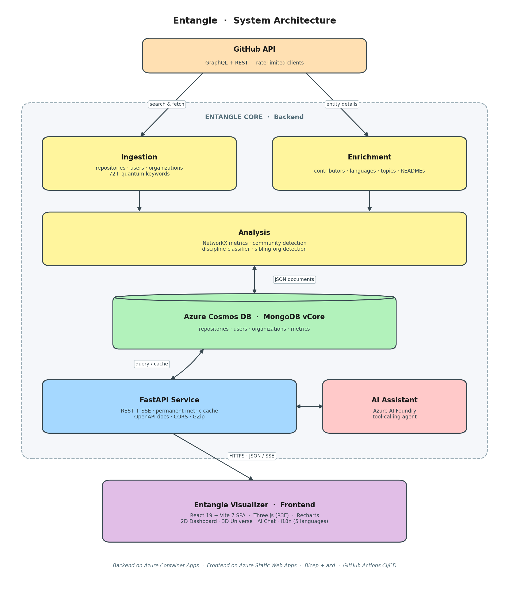

<div align="center">

<sub>🇬🇧 <b>English</b>  ·  <a href="./README.es.md">🇪🇸 Español</a></sub>


# Entangle&nbsp;Core

**Analytics engine for the open-source quantum computing ecosystem on GitHub.**

Ingestion, enrichment, network analysis and AI-powered insights, served through a production-ready FastAPI backend.

[](https://www.python.org/)
[](https://fastapi.tiangolo.com/)
[](https://learn.microsoft.com/azure/cosmos-db/mongodb/vcore/)
[](https://azure.microsoft.com/products/container-apps)
[](./Dockerfile)
[](./tests)
[](#testing)
[](#quality--code-analysis)
[](#quality--code-analysis)
[](./LICENSE)

[**Open app**](https://blue-rock-0771cc403.1.azurestaticapps.net) ·
[**Frontend repo**](https://github.com/Angel-TFG-UCLM/Entangle-Visualizer) ·
[**Report a bug**](https://github.com/Angel-TFG-UCLM/Entangle-Core/issues)

</div>

---

## Overview

**Entangle Core** is the data and intelligence backbone of the [Entangle](https://github.com/Angel-TFG-UCLM/Entangle-Visualizer) project: a research-grade platform that maps and analyses the global open-source quantum computing ecosystem on GitHub.

It crawls public repositories, organizations and developers matching a curated taxonomy of 70+ quantum keywords (Qiskit, Cirq, PennyLane, Braket, QAOA, VQE, QML, NISQ, etc.), enriches them with collaboration, language and topic metadata, computes network metrics over the resulting graph, and exposes everything through a typed REST API consumed by the [Entangle Visualizer](https://github.com/Angel-TFG-UCLM/Entangle-Visualizer) dashboard.

> Built as the backend component of a Bachelor's Final Project (TFG) at the **University of Castilla-La Mancha (UCLM)**.

---

## Table of contents

- [Key features](#key-features)
- [Architecture](#architecture)
- [Tech stack](#tech-stack)
- [Project structure](#project-structure)
- [Getting started](#getting-started)
- [Configuration](#configuration)
- [Running the pipeline](#running-the-pipeline)
- [API reference](#api-reference)
- [Testing](#testing)
- [Quality & Code Analysis](#quality--code-analysis)
- [Deployment](#deployment)
- [Roadmap](#roadmap)
- [Contributing](#contributing)
- [Citation](#citation)
- [License](#license)
- [Acknowledgements](#acknowledgements)

---

## Key features

- **Domain-aware ingestion.** Multi-segment GitHub search driven by a curated taxonomy of quantum keywords, with rate-limit aware GraphQL/REST clients and incremental mode (only new/updated entities).
- **Three-entity model.** Independent ingestion and enrichment pipelines for `repositories`, `users` and `organizations`, with cross-entity linking (contributors, members, sibling orgs).
- **Sibling-organization detection.** Heuristic that links related orgs (e.g. `Qiskit` ↔ `qiskit-community`) using token and prefix matching, tuned to avoid false positives in the quantum domain.
- **Collaboration network analysis.** Builds a contributor-organization graph with [NetworkX](https://networkx.org/) and computes degree, betweenness, eigenvector centrality, community detection and bridge-user identification.
- **Discipline classification.** Heuristic NLP classifier that tags users into quantum sub-disciplines (algorithms, hardware engineering, ML, chemistry, etc.).
- **AI assistant.** Chat endpoint backed by **Azure AI Foundry** (Azure OpenAI) with tool-calling over the live dataset, so users can ask natural-language questions like *"top 5 repositories with the most stars"*.
- **Permanent metric cache.** Pre-computed dashboard payloads stored in MongoDB and invalidated explicitly after each ingestion/enrichment, keeping the dashboard responsive.
- **Production-grade API.** FastAPI with CORS, GZip, structured logging, lifespan-managed connections, OpenAPI/Swagger docs and health checks.
- **Cloud-native deployment.** Containerised with a multi-stage-friendly `Dockerfile`, deployed to **Azure Container Apps** via Bicep + Azure Developer CLI (`azd`).
- **Tested and typed.** `pytest` suite with coverage, `pydantic` v2 models, `black` / `flake8` / `mypy` configured.

---

## Architecture

<p align="center">
  
</p>

---

## Tech stack

| Layer | Technology |
|---|---|
| **Language** | Python 3.11 |
| **Web framework** | FastAPI 0.115, Uvicorn, Pydantic v2 |
| **Database** | Azure Cosmos DB for MongoDB vCore (PyMongo 4.x) |
| **GitHub clients** | `requests` (REST) + custom GraphQL client with rate-limit handling |
| **Network analysis** | NetworkX 3.x |
| **AI / LLM** | Azure AI Foundry (Azure OpenAI), `azure-identity`, tool-calling agent |
| **Auth utilities** | `bcrypt` for admin endpoints |
| **Quality** | `pytest`, `pytest-cov`, `pytest-mock`, `black`, `flake8`, `mypy` |
| **Containerisation** | Docker (Python 3.11-slim, non-root user, healthcheck) |
| **IaC & deploy** | Bicep + Azure Developer CLI (`azd`), Azure Container Apps, ACR, GitHub Actions |
| **Observability** | Structured logger, optional Application Insights |

---

## Project structure

```
Backend/
├── src/
│   ├── api/                 # FastAPI app, routes, admin & chat routes
│   ├── ai/                  # Azure AI Foundry agent, prompts, tool functions
│   ├── analysis/            # Network metrics & discipline classifier
│   ├── github/              # Ingestion + enrichment per entity, GraphQL client
│   ├── core/                # Config, logger, Mongo repository, cache
│   ├── models/              # Pydantic models
│   └── utils/               # Shared helpers
├── scripts/                 # CLI runners for the full pipeline & checks
├── config/
│   ├── ingestion_config.json    # Quantum keyword taxonomy & search rules
│   └── pipeline_config.json     # Pipeline orchestration settings
├── infra/                   # Bicep modules + parameters for Azure deployment
├── tests/                   # pytest suite
├── Dockerfile               # Container image (Azure Container Apps ready)
├── azure.yaml               # azd configuration
├── deploy.ps1               # One-shot deployment helper (Windows)
└── requirements.txt
```

---

## Getting started

### Prerequisites

- **Python 3.11+**
- A **GitHub personal access token** with `repo`, `read:org`, `read:user` scopes
- A reachable **MongoDB** instance (local or Azure Cosmos DB for MongoDB vCore)
- *(Optional)* An **Azure AI Foundry** deployment for the chat endpoint
- *(Optional, for deployment)* [Azure CLI](https://learn.microsoft.com/cli/azure/install-azure-cli) and [Azure Developer CLI (`azd`)](https://learn.microsoft.com/azure/developer/azure-developer-cli/install-azd)

### 1. Clone

```bash
git clone https://github.com/Angel-TFG-UCLM/Entangle-Core.git
cd Entangle-Core
```

### 2. Create a virtual environment

```bash
python -m venv .venv
# Windows
.\.venv\Scripts\Activate.ps1
# macOS / Linux
source .venv/bin/activate

pip install --upgrade pip
pip install -r requirements.txt
```

### 3. Configure environment variables

```bash
cp .env.example .env
# Edit .env and fill in GITHUB_TOKEN, MONGO_URI, AZURE_AI_* if applicable
```

### 4. Run the API locally

```bash
uvicorn src.api.main:app --reload --host 0.0.0.0 --port 8000
```

The API is now available at:

- **Swagger UI:** http://localhost:8000/docs
- **ReDoc:** http://localhost:8000/redoc
- **Health:** http://localhost:8000/api/v1/health

---

## Configuration

All runtime configuration is loaded from environment variables (see [`.env.example`](./.env.example)). Pipeline behaviour is controlled by two JSON files:

| File | Purpose |
|---|---|
| [`config/ingestion_config.json`](./config/ingestion_config.json) | Curated keyword taxonomy, search filters and entity rules used during ingestion. |
| [`config/pipeline_config.json`](./config/pipeline_config.json) | Orchestration: incremental vs from-scratch mode, parallel phases, batch sizes, enrichment limits. |

Both files are documented inline through `*_description` fields, so they double as self-describing configuration.

---

## Running the pipeline

The full pipeline is orchestrated from `scripts/run_full_pipeline.py` and is split into three phases:

1. **Ingestion**: discovers repositories, users and organisations matching the taxonomy.
2. **Enrichment**: fetches full metadata (contributors, members, languages, topics, READMEs).
3. **Analysis**: computes network metrics, classifies disciplines and rebuilds the dashboard cache.

```bash
# Full pipeline (incremental by default)
python scripts/run_full_pipeline.py

# Individual stages
python scripts/run_repositories_ingestion.py
python scripts/run_user_enrichment.py
python scripts/run_organization_enrichment.py
```

Logs are written to `logs/` and a JSON summary to `ingestion_results.json`.

<p align="center">
  
  <br/><sub><i>Placeholder: terminal screenshot of a successful pipeline run.</i></sub>
</p>

---

## API reference

The API is versioned under `/api/v1`. Highlights:

| Method | Endpoint | Description |
|---|---|---|
| `GET` | `/health` | Liveness probe. |
| `GET` | `/stats` | Cached global counts (repos / users / orgs). |
| `GET` | `/dashboard/stats` | Pre-computed dashboard payload (KPIs, charts, graph, tables). Supports `org`, `language`, `repo`, `collab_type`, `discipline`, `include_bots`, `force_refresh`. |
| `GET` | `/organizations`, `/repositories`, `/users` | Paginated entity listings with filters. |
| `GET` | `/network/{view}` | Collaboration graph payload for a given view (orgs, repos, contributors). |
| `POST` | `/chat` | Natural-language assistant powered by Azure AI Foundry with tool-calling over the dataset. |
| `POST` | `/admin/*` | Authenticated admin operations (refresh metrics, trigger re-enrichment, etc.). |

The full, always up-to-date schema lives in **Swagger UI** at `/docs` and **ReDoc** at `/redoc`.

---

## Testing

```bash
# Run the full suite
pytest

# With coverage
pytest --cov=src --cov-report=term-missing --cov-report=xml
```

Coverage reports are written to `coverage.xml` and consumed by CI.

---

## Quality & Code Analysis

Code is analysed with **SonarQube Community Edition** (self-hosted in Docker) against a custom Quality Gate called **«Entangle»**, defined in the project's Bachelor's Thesis report. The gate enforces nine conditions:

| Metric | Operator | Threshold |
|---|---|---|
| Reliability Rating | ≤ | C |
| Security Rating | ≤ | A |
| Maintainability Rating | ≤ | B |
| Coverage | ≥ | 60 % |
| Duplicated Lines Density | ≤ | 5 % |
| Duplication on New Code | ≤ | 3 % |
| New Issues | ≤ | 0 |
| Security Hotspots Reviewed | ≥ | 80 % |
| Vulnerabilities | ≤ | 0 |

**Latest results for `entangle-backend`**:

| Metric | Value |
|---|---|
| Lines of code | 14 687 |
| Files | 35 |
| **Quality Gate** | ✅ **PASSED** |
| Coverage | **61.0 %** |
| Duplicated lines | **2.1 %** |
| Bugs | 0 |
| Vulnerabilities | 0 |
| Security Hotspots reviewed | 100 % |
| Code Smells | 294 |
| Technical Debt | 72 h |
| Reliability / Security / Maintainability | **A / A / A** |

A second analysis runs automatically on every push via SonarQube Cloud (free plan) at <https://sonarcloud.io/project/overview?id=Angel-TFG-UCLM_Entangle-Core>. The cloud free plan applies the built-in *Sonar way* gate; the custom **«Entangle»** gate is enforced locally.

To reproduce the local analysis:

```powershell
$env:SONAR_LOCAL_TOKEN = "squ_xxxxxxxxxxxx"
./scripts/Run-LocalSonar.ps1
```

See [`LOCAL_SONAR.md`](../LOCAL_SONAR.md) for full setup instructions.

---

## Deployment

Entangle Core ships with **Infrastructure as Code (Bicep)** and an **`azd` template** that provision and deploy:

- An **Azure Container Registry** (ACR)
- An **Azure Container Apps** environment + the `entangle-api` Container App
- An **Azure Cosmos DB for MongoDB (vCore)** cluster
- An **Azure AI Foundry** project (optional)
- All required role assignments via **managed identity** (least privilege)

### One-command deploy

```bash
# Login
azd auth login

# Provision + deploy in one step
azd up
```

CI/CD is wired through GitHub Actions (`.github/workflows/`):

- `entangle-api` → builds the image, pushes it to ACR and rolls out the Container App on every push to `main`.
- `entangle-api-stagging` → same flow targeting the staging environment from the `develop` branch.

See [`infra/main.bicep`](./infra/main.bicep) and [`deploy.ps1`](./deploy.ps1) for details.

---

## Roadmap

- Expand the AI assistant with deeper analytical capabilities and proactive insights.
- Extend the ingestion pipeline to other platforms beyond GitHub (GitLab, Hugging Face, arXiv).
- Add ecosystem trend prediction (forecasting growth, emerging tools, rising contributors).

---

## Contributing

Contributions, bug reports and ideas are very welcome. Please:

1. Open an issue describing the change you would like to make.
2. Fork the repo and create a feature branch (`git checkout -b feat/my-feature`).
3. Run `pytest` and `black src tests` before submitting.
4. Open a pull request against `main` describing the motivation and the change.

---

## Citation

If you use Entangle in academic work, please cite it as:

```bibtex
@software{lara_entangle_2026,
  author  = {Lara Martín, Ángel Luis},
  title   = {Entangle: an analytics platform for the open-source quantum computing ecosystem},
  year    = {2026},
  url     = {https://github.com/Angel-TFG-UCLM/Entangle-Core},
  note    = {Bachelor's Final Project, University of Castilla-La Mancha}
}
```

A machine-readable [`CITATION.cff`](./CITATION.cff) is also provided.

---

## License

Released under the [MIT License](./LICENSE).

---

## Acknowledgements

- **University of Castilla-La Mancha (UCLM)** and the academic tutor of this TFG, **Ricardo Pérez del Castillo** ([@ricpdc](https://github.com/ricpdc)).
- The **open-source quantum computing community** (Qiskit, Cirq, PennyLane, Braket, PyQuil, and many more) whose public work makes this analysis meaningful.
- **Microsoft Azure** for the cloud infrastructure (Container Apps, Cosmos DB vCore, AI Foundry).
- The maintainers of **FastAPI**, **NetworkX**, **PyMongo** and the wider Python ecosystem.

<div align="center">

Built with lots of coffee and curiosity by **Ángel Luis Lara Martín** · [Entangle Visualizer →](https://github.com/Angel-TFG-UCLM/Entangle-Visualizer)

</div>
