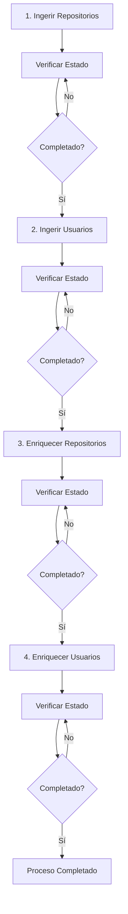

# Documentación de API - Endpoints de Ingesta y Enriquecimiento

Esta guía documenta los nuevos endpoints de la API para ejecutar operaciones de ingesta y enriquecimiento de repositorios y usuarios de GitHub.

## 📋 Índice

- [Endpoints de Ingesta](#endpoints-de-ingesta)
  - [Ingerir Repositorios](#post-ingestionrepositories)
  - [Ingerir Usuarios](#post-ingestionusers)
- [Endpoints de Enriquecimiento](#endpoints-de-enriquecimiento)
  - [Enriquecer Repositorios](#post-enrichmentrepositories)
  - [Enriquecer Usuarios](#post-enrichmentusers)
- [Endpoints de Consulta](#endpoints-de-consulta)
  - [Estado de Tarea](#get-ingestionstatustask_id)
  - [Listar Tareas](#get-tasks)
- [Flujo de Trabajo Completo](#flujo-de-trabajo-completo)
- [Ejemplos de Uso](#ejemplos-de-uso)

---

## Endpoints de Ingesta

### `POST /api/v1/ingestion/repositories`

Ejecuta la ingesta de repositorios de GitHub usando los criterios configurados en `config/ingestion_config.json`.

**Parámetros Query:**
- `max_results` (opcional): Máximo de repositorios a ingerir
- `incremental` (opcional, default: `false`): Modo incremental, solo actualiza cambios
- `use_segmentation` (opcional, default: `false`): Usa segmentación para superar límite de 1000 repos

**Respuesta:**
```json
{
  "task_id": "repo_ingestion_20251126_143022",
  "status": "running",
  "message": "Ingesta de repositorios iniciada en segundo plano",
  "check_status_url": "/api/v1/ingestion/status/repo_ingestion_20251126_143022"
}
```

**Ejemplo cURL:**
```bash
curl -X POST "https://tu-api.azurecontainerapps.io/api/v1/ingestion/repositories?max_results=100&use_segmentation=true"
```

---

### `POST /api/v1/ingestion/users`

Ejecuta la ingesta de usuarios desde los repositorios ya ingestados. Extrae usuarios del campo `collaborators`.

**Parámetros Query:**
- `max_repos` (opcional): Máximo de repositorios a procesar
- `batch_size` (opcional, default: `50`): Tamaño del lote para procesamiento

**Respuesta:**
```json
{
  "task_id": "user_ingestion_20251126_143122",
  "status": "running",
  "message": "Ingesta de usuarios iniciada en segundo plano",
  "check_status_url": "/api/v1/ingestion/status/user_ingestion_20251126_143122"
}
```

**Ejemplo cURL:**
```bash
curl -X POST "https://tu-api.azurecontainerapps.io/api/v1/ingestion/users?max_repos=50"
```

---

## Endpoints de Enriquecimiento

### `POST /api/v1/enrichment/repositories`

Enriquece repositorios ya ingestados, completando información faltante usando GraphQL y REST API.

**Parámetros Query:**
- `max_repos` (opcional): Máximo de repositorios a enriquecer
- `force_reenrich` (opcional, default: `false`): Re-enriquece repositorios ya enriquecidos
- `batch_size` (opcional, default: `10`): Tamaño del lote

**Respuesta:**
```json
{
  "task_id": "repo_enrichment_20251126_143222",
  "status": "running",
  "message": "Enriquecimiento de repositorios iniciado en segundo plano",
  "check_status_url": "/api/v1/enrichment/status/repo_enrichment_20251126_143222"
}
```

**Ejemplo cURL:**
```bash
curl -X POST "https://tu-api.azurecontainerapps.io/api/v1/enrichment/repositories?max_repos=50&batch_size=10"
```

---

### `POST /api/v1/enrichment/users`

Enriquece usuarios ya ingestados, completando información faltante.

**Parámetros Query:**
- `max_users` (opcional): Máximo de usuarios a enriquecer
- `force_reenrich` (opcional, default: `false`): Re-enriquece usuarios ya enriquecidos
- `batch_size` (opcional, default: `10`): Tamaño del lote

**Respuesta:**
```json
{
  "task_id": "user_enrichment_20251126_143322",
  "status": "running",
  "message": "Enriquecimiento de usuarios iniciado en segundo plano",
  "check_status_url": "/api/v1/enrichment/status/user_enrichment_20251126_143322"
}
```

**Ejemplo cURL:**
```bash
curl -X POST "https://tu-api.azurecontainerapps.io/api/v1/enrichment/users?max_users=100"
```

---

## Endpoints de Consulta

### `GET /api/v1/ingestion/status/{task_id}`
### `GET /api/v1/enrichment/status/{task_id}`

Consulta el estado de una tarea de ingesta o enriquecimiento.

**Parámetros Path:**
- `task_id`: ID de la tarea a consultar

**Respuesta (en ejecución):**
```json
{
  "status": "running",
  "started_at": "2025-11-26T14:30:22",
  "progress": "Procesando lote 5/10...",
  "stats": null,
  "error": null
}
```

**Respuesta (completada):**
```json
{
  "status": "completed",
  "started_at": "2025-11-26T14:30:22",
  "completed_at": "2025-11-26T14:45:30",
  "progress": "Ingesta completada exitosamente",
  "stats": {
    "total_found": 2519,
    "total_filtered": 2150,
    "repositories_inserted": 2150,
    "duration_seconds": 915.3
  },
  "error": null
}
```

**Respuesta (error):**
```json
{
  "status": "failed",
  "started_at": "2025-11-26T14:30:22",
  "failed_at": "2025-11-26T14:32:15",
  "progress": "Error: GitHub API rate limit exceeded",
  "stats": null,
  "error": "GitHub API rate limit exceeded"
}
```

**Ejemplo cURL:**
```bash
curl "https://tu-api.azurecontainerapps.io/api/v1/ingestion/status/repo_ingestion_20251126_143022"
```

---

### `GET /api/v1/tasks`

Lista todas las tareas de ingesta y enriquecimiento (activas e históricas).

**Respuesta:**
```json
{
  "total_tasks": 4,
  "tasks": [
    {
      "task_id": "repo_ingestion_20251126_143022",
      "status": "completed",
      "started_at": "2025-11-26T14:30:22",
      "progress": "Ingesta completada exitosamente"
    },
    {
      "task_id": "user_ingestion_20251126_143122",
      "status": "running",
      "started_at": "2025-11-26T14:31:22",
      "progress": "Procesando usuarios..."
    }
  ]
}
```

**Ejemplo cURL:**
```bash
curl "https://tu-api.azurecontainerapps.io/api/v1/tasks"
```

---

## Flujo de Trabajo Completo

### Workflow Recomendado



### Script de Ejemplo (Bash)

```bash
#!/bin/bash
API_URL="https://tu-api.azurecontainerapps.io/api/v1"

# 1. Iniciar ingesta de repositorios
echo "🔄 Iniciando ingesta de repositorios..."
TASK_RESPONSE=$(curl -s -X POST "$API_URL/ingestion/repositories?use_segmentation=true")
TASK_ID=$(echo $TASK_RESPONSE | jq -r '.task_id')
echo "✅ Task ID: $TASK_ID"

# 2. Esperar a que complete
while true; do
    STATUS=$(curl -s "$API_URL/ingestion/status/$TASK_ID" | jq -r '.status')
    if [ "$STATUS" = "completed" ]; then
        echo "✅ Ingesta de repositorios completada"
        break
    elif [ "$STATUS" = "failed" ]; then
        echo "❌ Error en ingesta de repositorios"
        exit 1
    fi
    echo "⏳ Estado: $STATUS"
    sleep 30
done

# 3. Iniciar ingesta de usuarios
echo "🔄 Iniciando ingesta de usuarios..."
TASK_RESPONSE=$(curl -s -X POST "$API_URL/ingestion/users")
TASK_ID=$(echo $TASK_RESPONSE | jq -r '.task_id')
echo "✅ Task ID: $TASK_ID"

# (Continuar el flujo...)
```

---

## Ejemplos de Uso

### Ejemplo 1: Ingesta Completa con Segmentación

```bash
# Ingerir todos los repositorios usando segmentación
curl -X POST "https://tu-api.azurecontainerapps.io/api/v1/ingestion/repositories?use_segmentation=true"
```

### Ejemplo 2: Ingesta Incremental

```bash
# Solo actualizar repositorios modificados
curl -X POST "https://tu-api.azurecontainerapps.io/api/v1/ingestion/repositories?incremental=true"
```

### Ejemplo 3: Enriquecimiento Limitado

```bash
# Enriquecer solo 100 repositorios
curl -X POST "https://tu-api.azurecontainerapps.io/api/v1/enrichment/repositories?max_repos=100"
```

### Ejemplo 4: Re-enriquecimiento Forzado

```bash
# Re-enriquecer todos los usuarios (incluidos los ya enriquecidos)
curl -X POST "https://tu-api.azurecontainerapps.io/api/v1/enrichment/users?force_reenrich=true"
```

### Ejemplo 5: Monitorear Progreso con Python

```python
import requests
import time

API_URL = "https://tu-api.azurecontainerapps.io/api/v1"

# Iniciar ingesta
response = requests.post(f"{API_URL}/ingestion/repositories")
task_id = response.json()["task_id"]
print(f"Task iniciada: {task_id}")

# Monitorear progreso
while True:
    status_response = requests.get(f"{API_URL}/ingestion/status/{task_id}")
    status_data = status_response.json()
    
    print(f"Estado: {status_data['status']}")
    print(f"Progreso: {status_data['progress']}")
    
    if status_data["status"] in ["completed", "failed"]:
        if status_data["status"] == "completed":
            print("✅ Completado!")
            print(f"Estadísticas: {status_data['stats']}")
        else:
            print(f"❌ Error: {status_data['error']}")
        break
    
    time.sleep(30)
```

---

## Notas Importantes

### ⏱️ Tiempos de Ejecución

- **Ingesta de repositorios**: 10-30 minutos (dependiendo de cantidad)
- **Ingesta de usuarios**: 5-15 minutos
- **Enriquecimiento de repos**: 15-45 minutos
- **Enriquecimiento de usuarios**: 10-30 minutos

### 🔒 Rate Limiting

Los procesos incluyen control automático de rate limit de GitHub API:
- Pausa automática cuando se alcanza el límite
- Espera hasta el reset del rate limit
- No requiere intervención manual

### 💾 Persistencia

Todos los datos se guardan automáticamente en MongoDB:
- Repositorios en colección `repositories`
- Usuarios en colección `users`
- Organizaciones en colección `organizations`
- Relaciones en colección `relations`

### 🔄 Background Tasks

Todas las operaciones se ejecutan en segundo plano:
- La API responde inmediatamente con un `task_id`
- El proceso continúa ejecutándose
- Consulta el estado con el endpoint `/status/{task_id}`

### ⚠️ Consideraciones

1. **Conexión a MongoDB**: Asegúrate de que `MONGO_URI` esté configurado
2. **Token de GitHub**: Debe tener permisos: `repo`, `read:org`, `read:user`
3. **Recursos Azure**: Las operaciones largas pueden requerir más recursos

---

## Endpoints Existentes (Sin Cambios)

Los siguientes endpoints siguen funcionando como antes:

- `GET /api/v1/health` - Health check
- `GET /api/v1/rate-limit` - Rate limit de GitHub
- `GET /api/v1/organizations/{org_login}` - Info de organización
- `GET /api/v1/repositories/{owner}/{name}` - Info de repositorio
- `GET /api/v1/users/{user_login}` - Info de usuario
- `GET /api/v1/search/repositories` - Búsqueda simple

---

## Documentación Interactiva

Una vez desplegada la API, accede a la documentación interactiva en:

- **Swagger UI**: `https://tu-api.azurecontainerapps.io/docs`
- **ReDoc**: `https://tu-api.azurecontainerapps.io/redoc`

Allí podrás probar todos los endpoints directamente desde el navegador.

---

## Soporte

Para problemas o preguntas:
1. Verifica logs: `azd monitor --logs`
2. Consulta estado de tareas: `GET /api/v1/tasks`
3. Verifica rate limit: `GET /api/v1/rate-limit`
